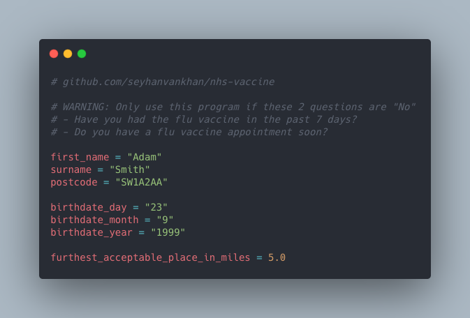

# Auto checker for nearby NHS COVID Vaccine appointments (UK)

For if you can't seem to find a vaccine appt near ya.

Leave this running in the background and it'll find a vaccine appoinment place down the road, in like 2 minutes.

### What he do tho
It fills in the entire [NHS Vaccine Booking form](https://www.nhs.uk/book-a-coronavirus-vaccination) and checks for nearby appointments every 3 seconds. Alerts you with text-to-speech.

## Requirements
- MacOS
- [Chrome](https://www.google.com/intl/en_uk/chrome/)
- [Python](https://www.python.org/downloads/)
- [Selenium](https://pypi.org/project/selenium/)

## Installation

1. Install **Python**: https://python.org/ftp/python/3.9.5/python-3.9.5-macosx10.9.pkg
2. Install **Pip**: https://pip.pypa.io/en/stable/installing/
3. Install **Selenium**: `pip3 install selenium`
## How to run

1. Download this project
2. Open main.py and **fill in your personal details**.
- *(Note: The data stays on that file. No-one else has it unless you specifically share)*

3. Run main.py in Python. 
```
python main.py
```
